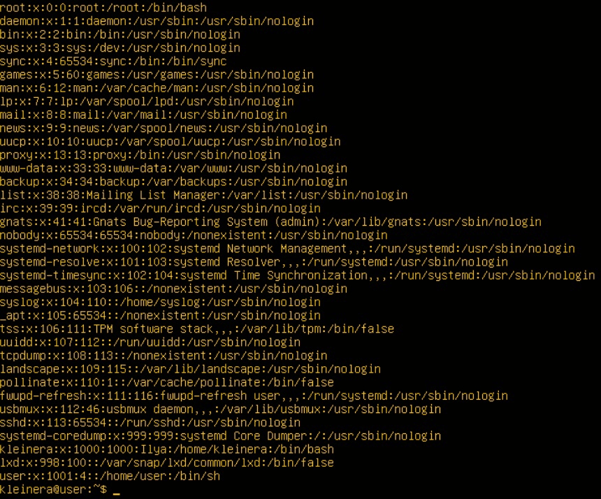
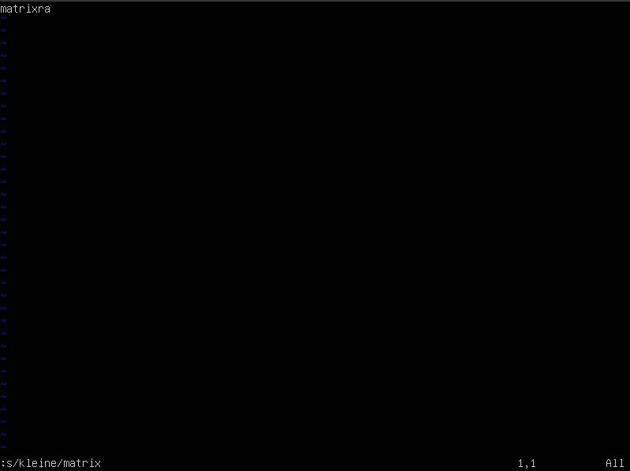
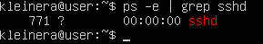
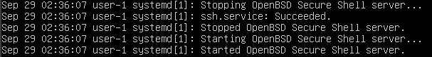
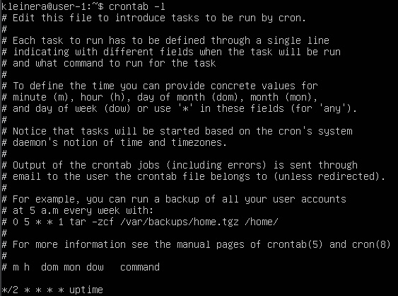

# Операционные системы UNIX/LINUX *(Базовый).

## Part 1. Установка OC

+ ***Проверка версии Ubuntu***

  

## Part 2. Создание пользователя

+ ***Создание и добавление пользователя в adm***
  
  
---

+ ***Вывод содержимого файла по пути (/etc/passwd), новый пользователь на предпоследней строчке***
  
  

## Part 3. Настройка сети OC

+ ***Задаем имя машине и выводим его***
  
  
---

+ ***Изменение времени и установка соответствующему местоположению***
  
  

---

+ ***Информация о сетевых интерфейсах***
  
  
  
  ***lo (loopback device)*** - виртуальный сетевой интерфейс. Фактически является локальной петлей, она имеет IP-адрес 127.0.0.1. Ее предназначение состоит в том, чтобы иметь доступ к своему же устройству. Также имеет dns-имя - localhost.
---

+ ***Получение IP-адреса устройства от DHCP сервера***
  
  

  ***DHCP - Dynamic Host Configuration Protocol***
---
+ ***Получение внешнего IP-адреса шлюза***
  
  
---

+ ***Получение внутреннего(основного) IP-адреса шлюза***
  
  
---

+ ***Переписали файл /etc/netplan/02-networkd.yaml, после чего применили данные и произвели ребут***
  
  

  
---

+ ***После перезапуска данные совпадают с предыдущими***
  
   
---
+  ***Успешная пропинговка удаленных хостов 1.1.1.1 и ya.ru***
  
   

## Part 4. Обновление OC

+ ***Обновление системы прошло успешно***
  
  

## Part 5. Использование команды **sudo**

+ ***Добавляем пользователя в группу с привилегиями sudo, после чего переключаемся на него и меняем hostname***
  
  

   ***sudo*** - позволяет выполнять задачи администрирования системы с максимальными правами.

## Part 6. Установка и настройка службы времени

+ ***Вывод команды с корректным временем***
  
  

## Part 7. Установка и использование текстовых редакторов

+ ***VIM*** Соответственно для сохранения и выхода из файла использовались **ESC** и команды **:wq**, а также название файла
  
  
---

+ ***NANO*** Для сохранения и выхода из файла для начала прожимаем **^O** - сохранение файла, после чего подтверждаем и прожимаем для выхода **^X**
   
  
---

+ ***JOE*** Сохранение и выход - ^KX, ввода имени файла и подтверждение
  
  
---

+ ***VIM*** Для выхода без сохранения: ***ESC > :q! > ENTER***
  
  
---

+ ***NANO*** Для выхода без сохранения: ***^X > N***
  
  
---

+ ***JOE*** Для выхода без сохранения: ***^C > Y***
  
  
---

+ ***VIM*** Для поиска используем ***/(что ищем)*** без скобок
  
  

+ ***VIM*** Для замены используем ***:s/(что ищем)/(на что заменяем)*** без скобок
  
  
---

+ ***NANO*** Для поиска используем ***^W > что ищем***
  
  

+ ***NANO*** Для замены используем ***^\ > что хотим заменить > чем хотим заменить > Y***
  
  
---

+ ***JOE*** Для поиска используем ***^K F > что ищем > I***
  
  

+ ***JOE*** Для замены используем ***^K F > что собираемся заменить > R > чем заменяем > Y***
  
  
  
## Part 8. Установка и настройка базового сервиса SSHD

+ ***Установка*** openssh-server
+ ***Запуск*** через команду sudo systemctl start ssh
+ ***Порт*** изменяется через ***sudo nano /etc/ssh/sshd_config***, меняем на 2022
+ ***Автозапуск*** через команду sudo systemctl enable ssh
+ ***Перезапуск системы*** ребутаем систему
+ ***Проверка*** через команду systemctl is-active ssh
+ ***Наличие процесса*** 
  
  
  
  ***ps*** - выводит сведения о процессах в статическом виде

  ***-e*** - все процессы
---

+ ***netstat -tan***
  
  

  ***-a*** - Отображает состояние сокетов (сокеты используемые серверными процессами обычно не отображаются)

  ***-n*** - Отображает сетевые адреса как числа, а не как символы

  ***-t*** - Отображает TCP подключения

  ***Proto*** - Тип протокола

  ***Recv-Q*** - Счетчик байтов не скопированных программой пользователя из этого сокета

  ***Send-Q*** - Счетик байтов, которые не подтверждены удаленнеым узлом

  ***Local Address*** - Адрес и номер порта локального конца сокета

  ***Foreign Address*** - Адрес и номер порта удаленного конца сокета 

  ***State*** - Состояние сокета

  ***LISTEN*** - Ожидание входящих подключений

  ***0.0.0.0*** - немаршрутизируемый адрес IPv4, который используется в качестве адреса по умолчанию или адреса-заполнителя
---

## Part 9. Установка и использование утилит **top**, **htop**

+ ***Uptume:*** 24 min
+ ***Users:*** 1
+ ***Load Avg:*** 0.00, 0.00, 0.00
+ ***Tasks:*** 119 total
+ ***%CPU(s):*** 0.0 us, 0.1 sy, 0.0 ni, 99.9 id, 0.0 wa, 0.0 hi, 0.0 si, 0.0 st
+ ***MiB Mem:*** 3919.5 total, 3372.1 free, 163.5 used, 383.9 buff/cache
+ ***PID MAX(MiB)*** 725
+ ***PID MAX(TIME+)*** 19
---

+ ***Сортировка по PID***
  
  

+ ***Сортировка по PERCENT_CPU***
  
  

+ ***Сортировка по PERCENT_MEM***
  
  

+ ***Сортировка по TIME***
  
  

+ ***Фильтрация для процесса sshd***
  
  

+ ***Поиск процесса syslog***
  
  

+ ***htop с добавленным выводом hostname, clock и uptime***
  
  

## Part 10. Использование утилиты **fdisk**

+ ***Disk /dev/sda, size = 8.82 GiB, 9448927744 bytes, 18454937 sectors***
  
  
  
## Part 11. Использование утилиты **df**

+ ***Единицы измерения в байтах***
  
  

+ ***Тип файловой системы для раздела - ext4***
  
  
  
## Part 12. Использование утилиты **du**

+ ***Использование команды du***
  
  

+ ***/home***
  
  

+ ***/var***
  
  

+ ***/var/log***
  
  

+ ***/var/log/****
  
  

## Part 13. Установка и использование утилиты ncdu

+ ***/home***
  
  

+ ***/var***
  
  

+ ***/var/log***
  
  

## Part 14. Работа с системными журналами

+ ***/var/log/dmesg***
  
  

+ ***/var/log/syslog***
  
  

+ ***/var/log/auth.log (время последней успешной авторизации 02:29:23, kleinera, через утилиту login)***
  
  

+ ***Перезапуск OpenSSH Server***
  
  

## Part 15. Использование планировщика заданий ***CRON***

+ ***uptime каждые 2 минуты***
  
  

+ ***Список текущих задач CRON***
  
  

+ ***Удаление задач и вывод списка***
  
  